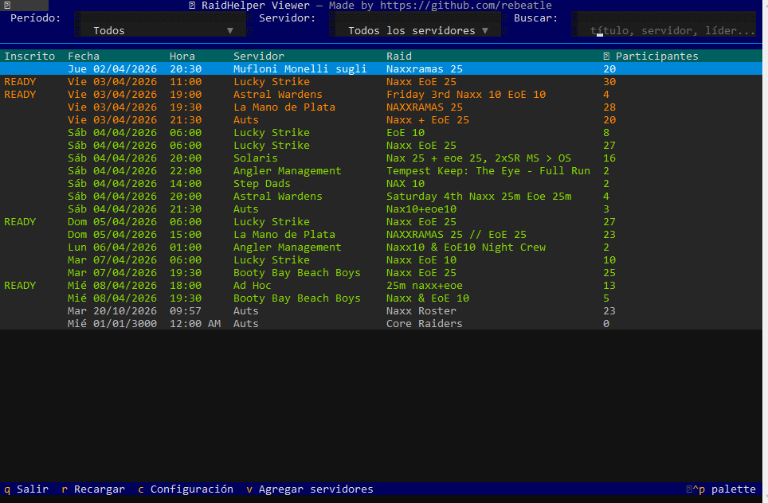
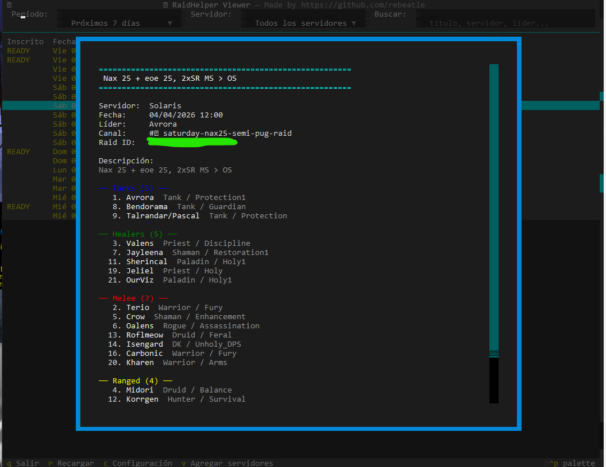
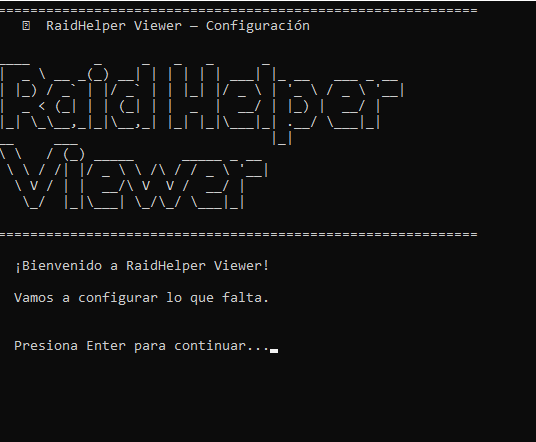
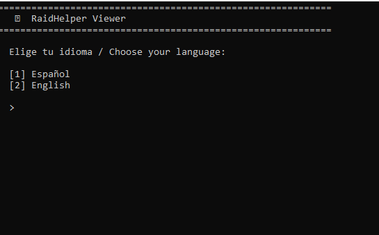
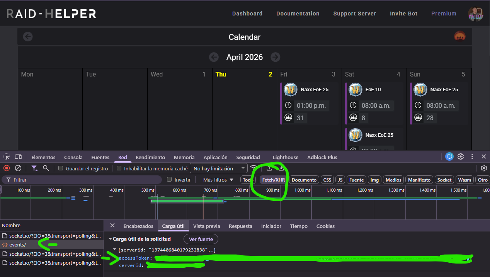
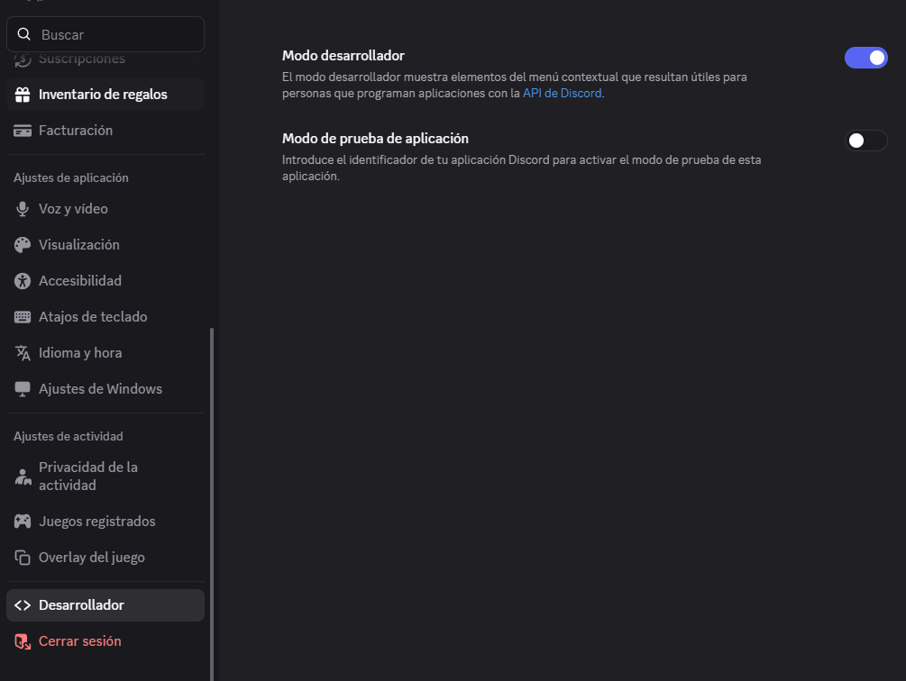
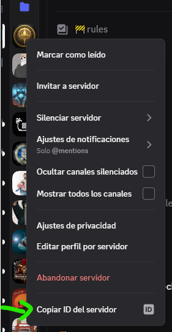
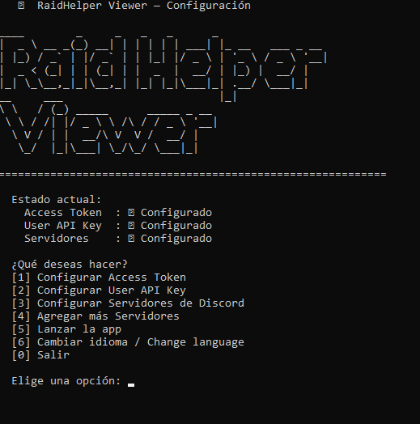

# English Version

> 🌐 [Versión en español](README.es.md)

# ⚔ Raid Helper Viewer (RHV)

A desktop dashboard to visualize all your Raid Helper events
across multiple Discord servers from a single screen.

> Built by [rebeatle](https://github.com/rebeatle) — because jumping between
> 14 Discord channels just to check the calendar is a raid by itself.

---

> ⚠️ **Aviso / Disclaimer**
>
> This is an unofficial, community-built tool. It is not affiliated with,
> endorsed by, or connected to Raid Helper or its developers in any way.
> It uses the same internal API that the raid-helper.xyz frontend uses,
> authenticated with your own personal session. If Raid Helper changes
> their API, this tool may stop working until updated.
>
> Use at your own risk. Your credentials are never stored on the server.

---

## What is this?

If you use Raid Helper across multiple Discord servers, you know the pain of
having to check channel by channel to see what raids are scheduled.

RHV solves that: a single screen with all your upcoming events, filters,
color coding by date proximity, and a mark showing which ones you're already signed up for.




---

## Features

- 📅 **Unified view** of events from multiple servers
- 🔴🟡🟢 **Color by proximity** — today, tomorrow, this week
- ✅ **Mark your events** — instantly see where you're already signed up
- 🔍 **Filters** by period, server, free text, and exact date
- 📋 **Full event details** with role signups (Tanks, Healers, Melee, Ranged)
- ⚡ **Parallel loading** — all servers fetched simultaneously
- 🔄 **Auto-reload** every 3 minutes (pauses while viewing event details)
- 💬 **Visual empty state** when no events match the current filters
- 🌐 **Spanish / English** — language selected on first run, changeable from settings
- ⌨️ **100% keyboard and mouse** — fast navigation

---

## Requirements

- Python 3.10+ → [download here](https://www.python.org/downloads/)
  - ⚠️ On Windows, check **"Add Python to PATH"** during installation
- Discord account with access to servers using Raid Helper

---

## Installation

1. Download the repository as a ZIP and extract it to your desktop
2. Open the folder and run the launcher for your OS:
   - **Windows:** double-click **`launcher.bat`**
   - **Linux / macOS:** run **`./launcher.sh`** from the terminal
3. The launcher installs dependencies automatically and guides you through setup



---

For advanced users, install dependencies manually:

```
pip install -r requirements.txt
```

---

## Initial Setup

### 0. Language selection
On the very first run, you will be asked to choose your language before anything else.



You can change it at any time from the settings menu (option `C` → option 6).

### 1. Access Token
This is your session token from raid-helper.xyz. To obtain it:

1. Go to [raid-helper.xyz](https://raid-helper.xyz) and log in with Discord
2. Once inside, open the calendar of any server
3. Press `F12` to open DevTools
4. Go to the **Network** tab and filter by **Fetch/XHR**
5. Reload the page with `F5`
6. Look for a call named **`events/`**
7. Click it and go to the **Payload** tab
8. You will see something like:
```json
{"serverid":"...","accessToken":"YOUR_TOKEN_HERE"}
```

9. Copy only the value of `accessToken` (the long string)

> ⚠️ This token is personal — do not share it with anyone.
> It expires over time. If the app stops showing events, repeat this process
> and update your `api.txt` with the new token (option `C` → Settings).

### 2. User API Key *(optional)*
Allows marking events with `READY` where you're already signed up.

1. In Discord, find the **Raid-Helper** bot in any server
2. Send it a direct message with: `/usersettings apikey show`
3. Copy the key it returns

If you don't configure it, the app still works but without signup marks.

> ℹ️ If you press Enter without typing anything in the settings menu,
> your existing key is kept unchanged.

### 3. Discord Server IDs
The servers where you have Raid Helper active.

**How to get a server ID?**
1. In Discord, enable Developer Mode:
   `Settings → Advanced → Developer Mode ✅`
2. Right-click the server
3. Select **Copy Server ID**

You can enter them one by one or from a `.txt` file with one ID per line.




---

## Controls

| Key | Action |
|-----|--------|
| `↑` `↓` | Navigate events |
| `Enter` | View full event details |
| `R` | Reload data from API |
| `C` | Open settings menu |
| `V` | Add more servers |
| `Esc` | Close detail window |
| `Q` | Exit |

### Settings menu



| Option | Action |
|--------|--------|
| `1` | Configure Access Token |
| `2` | Configure User API Key |
| `3` | Configure Discord Servers |
| `4` | Add more Servers |
| `5` | Launch the app |
| `6` | Change language |
| `0` | Exit |

---

## Filters

| Filter | Description |
|--------|-------------|
| **Period** | Next 7, 14 or 30 days, or all |
| **Server** | Filter by server name |
| **Search** | Free text on title, server or leader |
| **Date** | Exact date in `dd/mm` or `dd/mm/yyyy` format |

---

## Colors

| Color | Meaning |
|-------|---------|
| 🔴 Red | Event is today |
| 🟡 Yellow | Event is tomorrow |
| 🟢 Green | Event is this week |
| ⚪ White | Event is later |

---

## FAQ

**Why isn't the app showing events?**
Most likely your Access Token has expired. Go to Settings (`C`) → option 1,
and follow the steps to get a new token.

**Why don't I see `READY` on my events?**
You need to configure the User API Key. Go to Settings (`C`) → option 2.
If you already had it configured, it may have expired — get a new one with
`/usersettings apikey show` in Discord and update it from the menu.

**Does it work on Mac or Linux?**
Yes. Run `./launcher.sh` from the terminal. Make sure it has execute
permissions first: `chmod +x launcher.sh`.

**Is it official? Does it have Raid Helper permission?**
This is not an official Raid Helper product. It uses the same API as the
raid-helper.xyz frontend with your personal session. Each user authenticates
with their own credentials. If Raid Helper changes its API, it may stop
working until updated.

---

## Technical Notes

RHV replicates the calls made by the raid-helper.xyz frontend using
the Discord OAuth session `accessToken`. There is no publicly documented API —
this was discovered by observing the network traffic of the official website.

Event times are displayed in the **local timezone** of the machine running the app.

---

## Roadmap

Features planned for future versions:

- 📤 **Export to ICS** — generate an `.ics` file from the selected event
  to import directly into Google Calendar, Outlook, or any calendar client.

- 🎯 **Filter by role** — see which events have open spots for a specific
  role (Tanks, Healers, Melee, Ranged), making it easier to decide where
  to sign up.

- 🔃 **Sortable columns** — sort the table by server, participant count,
  or other fields by clicking on each column header.

---

## Contributions

Pull requests are welcome. If something breaks due to changes in the Raid Helper API, open an issue.

---

## Contact

To report bugs, suggestions, or commercial use:
📧 rebeatle.dev@gmail.com

---

## License

This project is licensed under **GNU GPL v3**.

You are free to use, study, and modify the code, but any distributed modified version must:
- Also be open source under GPL v3
- Give credit to the original author
- **Not be sold or used commercially** without explicit permission from the author

© 2026 [rebeatle](https://github.com/rebeatle) — All rights reserved under GPL v3.

For commercial use or special agreements, contact the author directly.
